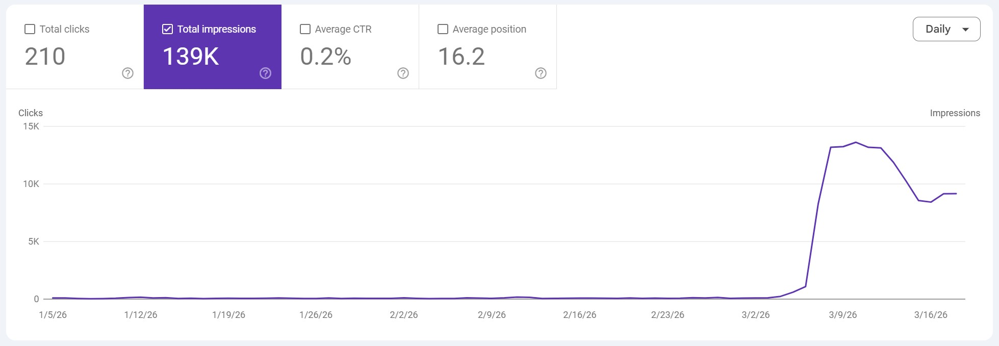
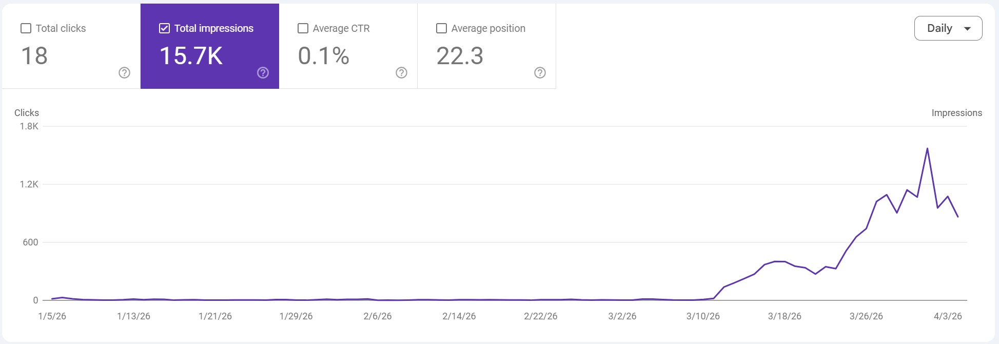
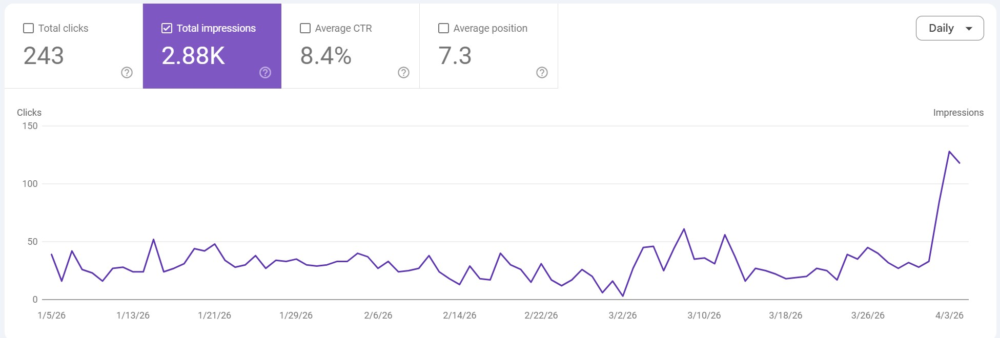

# SEO-Skills

Agent Skills for SEO workflows. Use them in [Cursor](https://cursor.com), [Claude Code](https://claude.com/product/claude-code), or any agent that loads skills.

## What’s included

- **Browser-first audits** — Logged-in **Google Search Console** and **Ahrefs** sessions (better than burning API/MCP quota when rate limits bite).
- **Snippet batch rewrites** — Turn GSC tier findings into **title / meta / schema headline** updates using patterns that worked in production.
- **Bulk guide shipping** — Reads **`seo-work-brief.md`** (written by the audit skill) for the **new guide backlog**, then ships pages + **routes, sitemap, hub** updates.
- **Room to grow** — More skills can land in this repo over time; PRs welcome.

## Results (GSC, author’s sites)

Search Console impressions after shipping this workflow on personal properties. Results vary by site.







## Requirements

- An AI coding agent that supports **Agent Skills** (or equivalent: markdown instructions loaded on demand).
- For [`gsc-ahrefs-browser-audit`](gsc-ahrefs-browser-audit/): **browser automation** (e.g. Playwright MCP, IDE browser tools), **internet access**, and accounts for **Google Search Console** and optionally **Ahrefs**. The agent must be able to **pause for you to sign in** when the UI requires it.

## How to use

### Option A — [Skills CLI](https://github.com/vercel-labs/skills) (recommended)

The [Vercel **skills** CLI](https://github.com/vercel-labs/skills) installs Agent Skills into Cursor, Claude Code, Codex, and [many other agents](https://github.com/vercel-labs/skills#supported-agents). It uses `npx` so you do not have to install anything globally.

**From GitHub** (replace the URL if you use a fork):

```bash
npx skills add https://github.com/BagelHole/SEO-Skills
```

**From a local clone** of this repo:

```bash
npx skills add /path/to/SEO-Skills
```

**Install only certain skills** (example: Cursor + audit skill, non-interactive):

```bash
npx skills add https://github.com/BagelHole/SEO-Skills --skill gsc-ahrefs-browser-audit -a cursor -y
```

**List skills in this repo** without installing:

```bash
npx skills add https://github.com/BagelHole/SEO-Skills --list
```

**Global CLI** (optional): `npm install -g skills`, then run `skills add …`, `skills list`, etc. Same commands as with `npx skills`.

More options (`-g` for user-wide install, `--copy` instead of symlinks, multiple `--skill` / `--agent` flags) are in the [skills CLI README](https://github.com/vercel-labs/skills).

### Option B — Manual

1. Clone this repository.
2. Copy or symlink each skill directory into your agent’s skills location.  
   **Cursor (example):** project skills live in `.agents/skills/<skill-name>/` (Skills CLI default) or `.cursor/skills/<skill-name>/`, or personal skills under `~/.cursor/skills/<skill-name>/`. The folder name must match the `name` field in `SKILL.md` (see the spec).
3. Ask your agent to run the workflow described in that skill’s `SKILL.md`.

Validate a skill locally with [skills-ref](https://github.com/agentskills/agentskills/tree/main/skills-ref) if you install it:

```bash
skills-ref validate ./gsc-ahrefs-browser-audit
skills-ref validate ./ctr-snippet-batch-optimize
skills-ref validate ./bulk-seo-guides-from-keywords
```

## Skills index

| `name` | Purpose | Path |
|--------|---------|------|
| `gsc-ahrefs-browser-audit` | GSC Performance + Ahrefs Site Explorer in the browser; CTR/ranking/impression findings | [`gsc-ahrefs-browser-audit/`](gsc-ahrefs-browser-audit/) |
| `ctr-snippet-batch-optimize` | Batch title/meta/schema rewrites from GSC tiers (0% CTR page 1–2 first) | [`ctr-snippet-batch-optimize/`](ctr-snippet-batch-optimize/) |
| `bulk-seo-guides-from-keywords` | Consumes **`seo-work-brief.md`** backlog; ships guides + routes + sitemap + resources | [`bulk-seo-guides-from-keywords/`](bulk-seo-guides-from-keywords/) |

## Disclaimer

These skills **automate or guide use of third-party products** (Google Search Console, Ahrefs, etc.). You are responsible for complying with each service’s terms, for your own credentials, and for how you use the data. This project is **not affiliated with** Google, Ahrefs, or any SEO vendor.

## Contributing

Pull requests are welcome. New skills should follow the [Agent Skills spec](https://agentskills.io/specification): valid YAML frontmatter, `name` matching the directory name, and a focused `SKILL.md` (move long material into `references/`). Run `skills-ref validate` on your skill before submitting if you can.

## License

[MIT](LICENSE)
